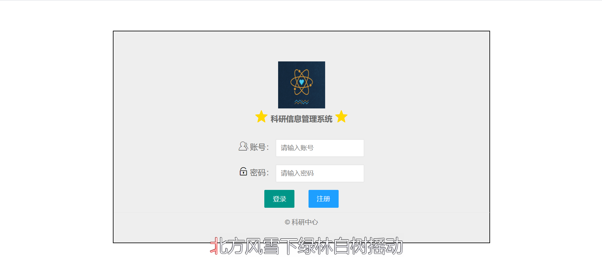
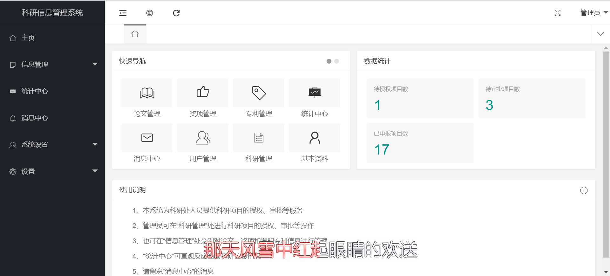
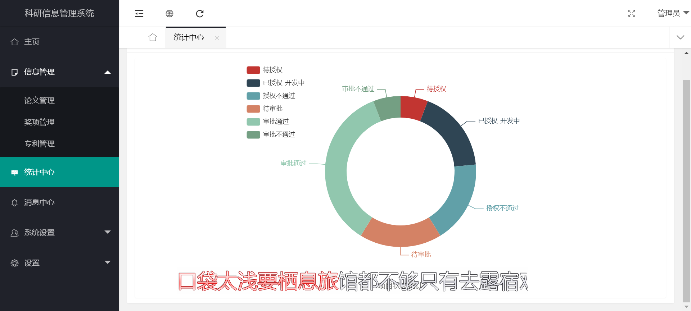
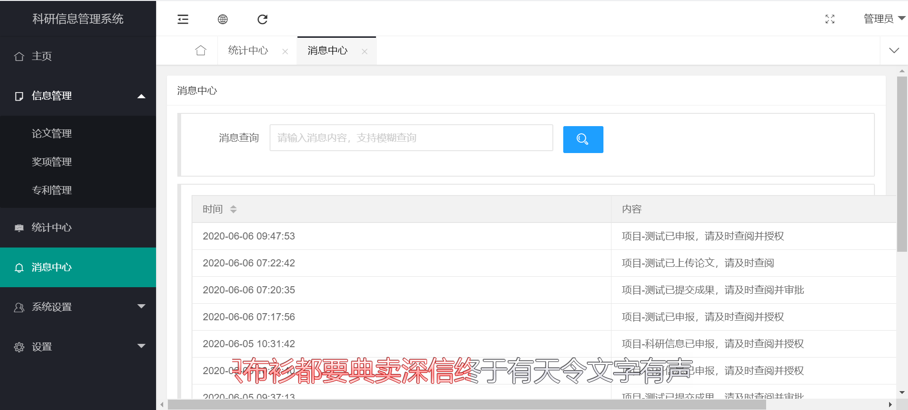
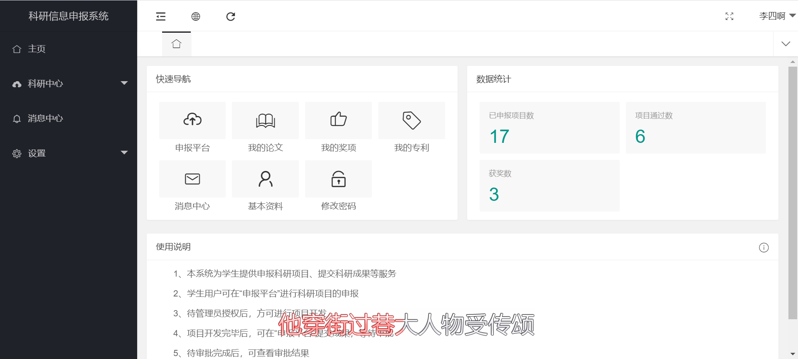
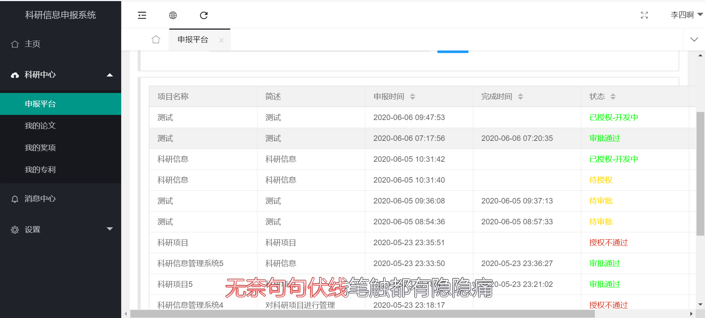

## 科研信息管理系统

作者：亚双义一真

时间：2020年4月16日~2020年5月2日

实现功能：Web管理系统，两类用户：管理员、用户

实现技术：LayUI+Spring Boot+MySQL+JPA+Shiro+echarts

平台：IDEA、jdk1.8

---

### 效果截图

- 登录界面

  

- 管理员

  

  

  

- 用户

  

  

---

### 备注

1. 数据库已放于项目根目录
2. 请尽量使用jdk1.8

